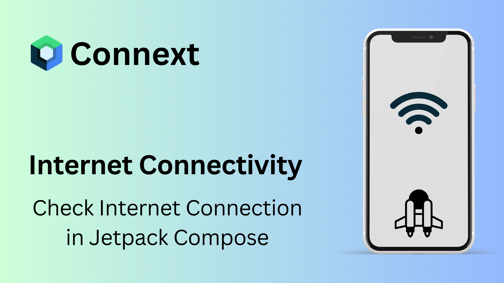

# Connext



🚀 Connext is a Jetpack Compose library to observe live connectivity status in a Compose way!

 


## 💡Introduction

Observing Live connectivity status in Jetpack Compose way! Connext is a Jetpack Compose library to observe live connectivity status in a Compose way! It provides a simple way to check connectivity status, network type, and internet connection status in Jetpack Compose.

## 🚀 Implementation

You can check [/app](/app) directory which includes example application for demonstration.

### Gradle setup
In `settings.gradle`  include this

```gradle
maven(url = "https://jitpack.io")
```


In `build.gradle` of app module, include this dependency

```gradle
dependencies {
    implementation ("com.github.tusharhow:Connext:1.0.0")
}
```


_You can find latest version and changelogs in the [releases](https://github.com/tusharhow/Connext/releases)_.

### Usage

#### 1. Check Connectivity Status:

```kotlin
 CheckConnectivityStatus(
  connectedContent = {
    Text("Connected")
  },
  disconnectedContent = {
    Text("Disconnected")
  }
)
```


#### 2. Check Current Connectivity Type:


```kotlin
  val context = LocalContext.current
  val networkType = context.getNetworkType()

when (networkType) {
  is NetworkType.WIFI -> {
    Text(text = "Connected to wifi")
  }
  is NetworkType.CELLULAR -> {
    Text(text = "Connected to cellular")
  }
  is NetworkType.NONE -> {
    Text(text = "No network")
  }
}
```

#### 3. Check Connected to the Internet:

```kotlin
val connection by connectivityStatus()
val isConnected = connection === ConnectionStatus.Connected

  if (isConnected) {
    Text(text = "Connected to internet")
  } else {
    Text(text = "No internet")
  }
```

## 📝 License

```
MIT License

Copyright (c) 2024 Tushar Mahmud

Permission is hereby granted, free of charge, to any person obtaining a copy
of this software and associated documentation files (the "Software"), to deal
in the Software without restriction, including without limitation the rights
to use, copy, modify, merge, publish, distribute, sublicense, and/or sell
copies of the Software, and to permit persons to whom the Software is
furnished to do so, subject to the following conditions:

The above copyright notice and this permission notice shall be included in all
copies or substantial portions of the Software.

THE SOFTWARE IS PROVIDED "AS IS", WITHOUT WARRANTY OF ANY KIND, EXPRESS OR
IMPLIED, INCLUDING BUT NOT LIMITED TO THE WARRANTIES OF MERCHANTABILITY,
FITNESS FOR A PARTICULAR PURPOSE AND NONINFRINGEMENT. IN NO EVENT SHALL THE
AUTHORS OR COPYRIGHT HOLDERS BE LIABLE FOR ANY CLAIM, DAMAGES OR OTHER
LIABILITY, WHETHER IN AN ACTION OF CONTRACT, TORT OR OTHERWISE, ARISING FROM,
OUT OF OR IN CONNECTION WITH THE SOFTWARE OR THE USE OR OTHER DEALINGS IN THE
SOFTWARE.
```